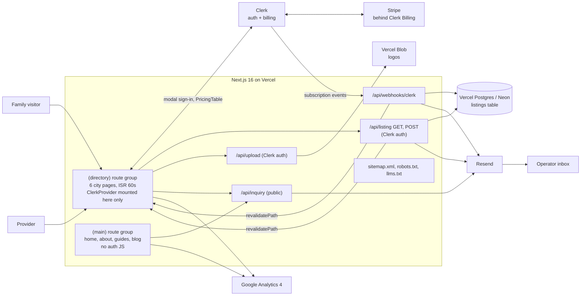

# It's an Art Party — architecture notes

These notes describe the real system as of September 2026 and are derived from the private codebase. Nothing here is aspirational.

## 1. System overview

## 2. Data model

One PostgreSQL table, accessed through Drizzle ORM over the Vercel Postgres driver.

**`listings`**

| Column | Notes |
|---|---|
| `id` | serial primary key |
| `clerk_user_id` | unique; one listing per provider account |
| `business_name`, `description`, `phone`, `email` | required listing content; the email is the listing's contact address and also receives provider lifecycle mail |
| `website`, `logo_url` | optional; the logo is a Vercel Blob URL |
| `city`, `state`, `directory_slug` | which city page the listing belongs to (the slug is the page path) |
| `active` | default true; the operator's manual moderation switch |
| `sponsored` | paid placement flag, set only server-side |
| `sponsored_at` | stamped on the transition into sponsorship, cleared on lapse; drives first-come-first-served ordering among sponsors |
| `created_at`, `updated_at` | timestamps |

There is no cities table: each city is its own page file with hand-written copy, and the listing's city, state and slug are stored as text. The public query selects only public fields (never the Clerk user id or timestamps), filters `active = true` by slug, and orders by `sponsored DESC, sponsored_at ASC, created_at ASC`. It is wrapped in React `cache()` so page metadata and the page body share one query per render.

Waitlist signups and inquiries are not stored; they are emails.

## 3. Routes

**Marketing, route group `(main)`**: home, about, kids birthdays, art lessons, contact, blog index, and blog posts at the site root (statically generated from an in-code post list, with BlogPosting and BreadcrumbList JSON-LD). This group's layout has no Clerk provider, so these pages ship no auth JavaScript.

**Directory, route group `(directory)`**: six city pages, each an async server component with `revalidate = 60`, per-page `generateMetadata`, server-fetched listings, and a `#get-listed` section containing the provider form, the upgrade panel and a directory contact form. The layout mounts the Clerk provider with brand appearance settings and a sign-out URL that returns to the current page.

**API route handlers**

| Route | Auth | Purpose |
|---|---|---|
| `POST /api/inquiry` | public | contact form, directory question and sponsor waitlist; emails the operator and optionally forwards to an outbound webhook; honeypot field |
| `GET /api/listing` | Clerk | the signed-in provider's listing |
| `POST /api/listing` | Clerk | upsert the provider's listing; recomputes `sponsored` from the live plan; revalidates the affected city page(s); sends welcome and admin email on first create only |
| `GET /api/listings?slug=` | public | public listings for a city (same query as the page) |
| `POST /api/upload` | Clerk | logo upload to Vercel Blob |
| `POST /api/webhooks/clerk` | Clerk signature | billing subscription lifecycle |

**Metadata routes**: `sitemap.xml` (main pages, all city pages, blog posts), `robots.txt` (allow all, sitemap pointer) and a static `llms.txt` describing the site for LLM crawlers.

All mutations go through route handlers called with `fetch` from client components; there are no server actions.

## 4. Key flows

### Authentication

Clerk's middleware runs on every non-static request (mounted under Next 16's `proxy` convention) but protects no routes by itself. Authorization is enforced inside each protected handler by calling Clerk's `auth()` and keying every read and write to the caller's user id. Every signed-in user is a potential provider; there are no roles, no admin accounts and no publicMetadata. The only entitlement is the Clerk Billing plan for sponsored placement, checked client-side for UI and server-side for data.

### Listing lifecycle

1. A provider signs up or signs in through Clerk modals on the city page.
2. The listing form uploads the logo on file select (JPEG, PNG, WebP or GIF, 2 MB max, stored under a per-user key with public access) and then posts the listing.
3. The handler validates required fields, computes `sponsored` from the provider's live plan, preserves `sponsored_at` on re-saves, stamps it on a new sponsorship and clears it on lapse, then upserts.
4. The handler revalidates the city page (both old and new pages if the listing moved city), and on first create emails the provider ("your listing is live") and the operator. The client refreshes the router so the server-rendered list updates immediately.

### Billing (Clerk Billing on Stripe)

There is one subscription plan, "Sponsored Result", priced in the Clerk dashboard. Checkout is Clerk's `PricingTable` rendered inside the city page's upgrade panel, with a redirect back to that page's `#get-listed` section. Subscription management uses Clerk's account menu; there is no custom portal.

The webhook verifies the signature with Clerk's helper and handles:

| Event | Effect |
|---|---|
| subscription item created or active | `UPDATE … SET sponsored = true, sponsored_at = now() WHERE clerk_user_id = payer AND sponsored = false` |
| subscription item canceled or ended | `UPDATE … SET sponsored = false, sponsored_at = null WHERE … AND sponsored = true` |

Both updates return the changed row; only when a row actually changed does the handler revalidate the city page and send the provider and operator emails. Redelivered events therefore update nothing and send nothing. Listings always stay active regardless of billing; the subscription controls placement only.

### Sponsor cap and waitlist

Each city allows three sponsored slots. When a city has three or more sponsors, the pricing table is replaced by an email waitlist form that posts to the inquiry endpoint. The cap is enforced in the UI only, because the billing provider has no notion of city; the code documents this as an accepted trade-off.

### Email

Resend is called through a small wrapper that never throws and returns a boolean; sends are skipped if the API key is absent. The sender and operator addresses come from environment variables. Templates are hand-written, table-based HTML with inline styles plus a plain-text alternative, and every user-supplied value is HTML-escaped.

| Template | Trigger |
|---|---|
| listing live | provider, on first listing create |
| new listing | operator, on first listing create |
| sponsorship active | provider, on webhook activation |
| sponsorship lapsed | provider, on webhook cancel or end |
| sponsorship changed | operator, on either transition |
| inquiry | operator, from the contact and directory forms, with reply-to set to the visitor |
| waitlist | operator, from the sponsor waitlist |

### Rendering, caching and SEO

- City pages use ISR with a 60-second window plus on-demand revalidation from the listing handler and the webhook.
- Titles follow "Best Kids Painting Party Providers in {City}, {ST} ({year})" and prepend the live count once a city has three or more listings.
- Each city page emits WebPage (with the city and state as `about`), BreadcrumbList, and an ItemList of LocalBusiness entries built from the live listings. The root layout emits Organization and WebSite.
- JSON-LD is serialized through a helper that escapes `<`, so a business name can never break out of the script tag.
- `trailingSlash` is on and `/blog/:slug` redirects permanently to `/:slug`, preserving the original WordPress permalinks.
- Internal links to every city page come from the homepage "find a party near you" block and the footer, because orphaned city pages were a documented past failure.

## 5. Deployment and operations

- **Hosting**: Vercel with automatic deploys from `main`. No `vercel.json`, no cron jobs, no background queue.
- **Configuration**: environment variables for the canonical site URL, the Postgres connection string, Clerk publishable and secret keys plus the webhook signing secret, the Blob read-write token, the Resend key with from and to addresses, and an optional outbound inquiry webhook.
- **Database workflow**: Drizzle config points at the schema and the Postgres URL; a Neon development branch backs local work.
- **Analytics**: Google Analytics 4 loaded with `lazyOnload` so it never competes with Largest Contentful Paint.
- **Quality gates**: TypeScript strict mode and ESLint (Next core-web-vitals and TypeScript configs) at build time. There is no automated test suite or CI pipeline beyond Vercel's build.
- **Security measures**: server-computed entitlements, signature-verified webhooks with replay-safe conditional updates, per-handler auth keyed to the caller, upload MIME allowlist and size limit, HTML escaping in email and JSON-LD, honeypot spam protection, public queries limited to public fields, and secrets confined to environment variables.
- **Known gaps** (deliberately documented): no rate limiting on the inquiry and upload endpoints, no schema-validation library on the listing payload, upload type taken from the client-declared MIME type, and the sponsor cap enforced only in the UI.

## 6. Timeline

| Date | Milestone |
|---|---|
| 2026-03-03 | WordPress theme converted to Next.js with all pages and blog; permalink parity |
| 2026-03-06 | First directory page (Scottsdale) |
| 2026-03-08 | Listing system with Clerk auth, billing and logo upload |
| 2026-03-11 | Pivot from single-provider site to multi-city directory |
| 2026-04 | AVIF/WebP image pipeline; analytics deferred behind LCP |
| 2026-05-13 | Clerk isolated to a directory-only route group |
| 2026-08-05 | Free listings plus paid Sponsored Results; server-rendered listings with ISR; LocalBusiness JSON-LD; dynamic titles; Frisco page |
| 2026-08-06 | Lifecycle email; soft sponsor cap with waitlist; identifiable children removed from imagery |
| 2026-08-07 | `llms.txt` route |
| 2026-08-17 · 08-31 · 09-22 | Gilbert, Plano and Katy pages launched |

About 120 commits between March and September 2026.
