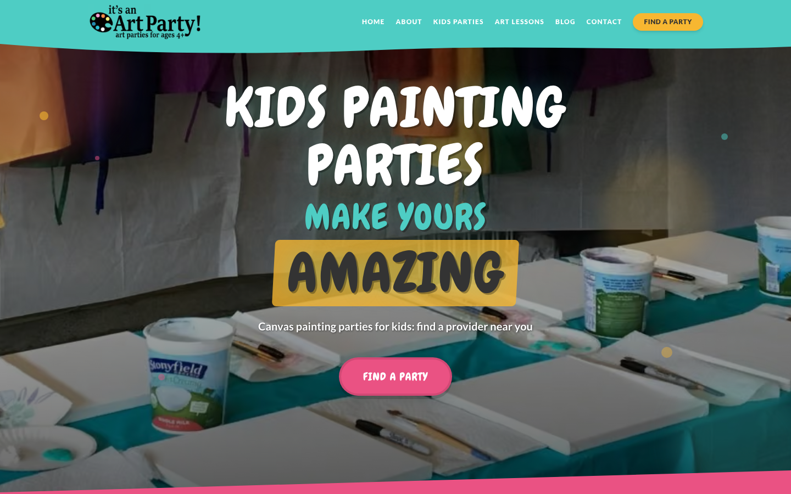
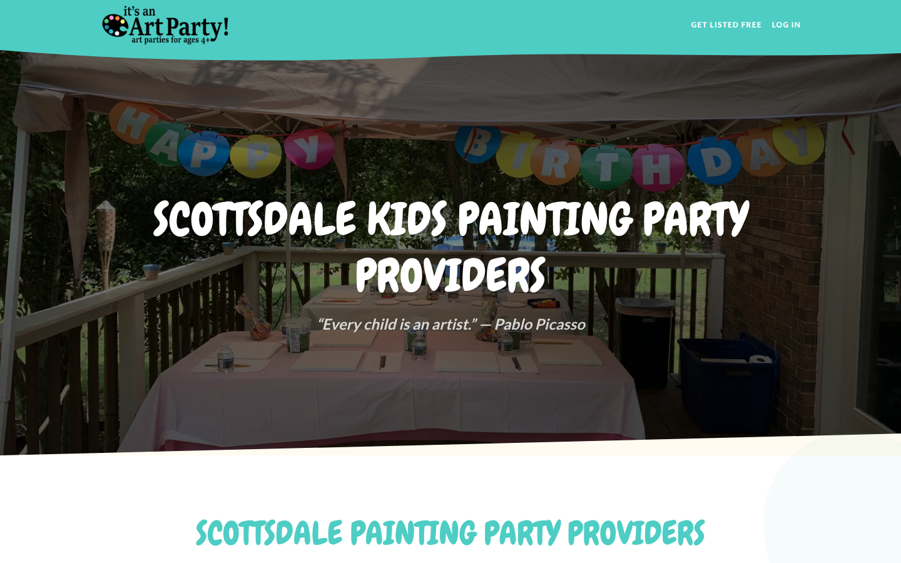
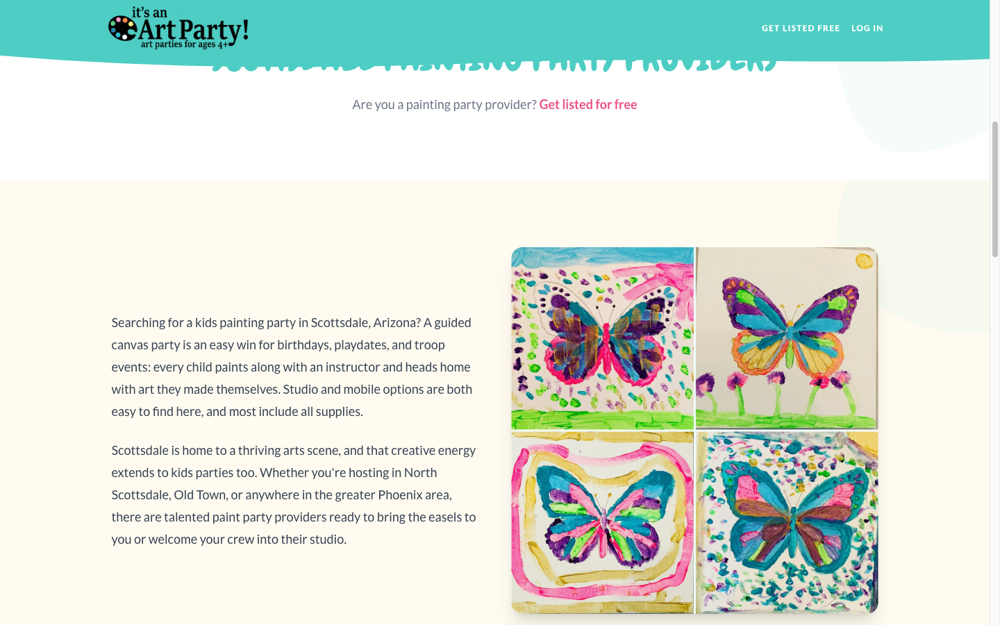
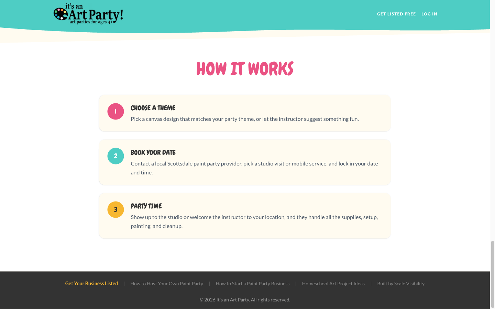
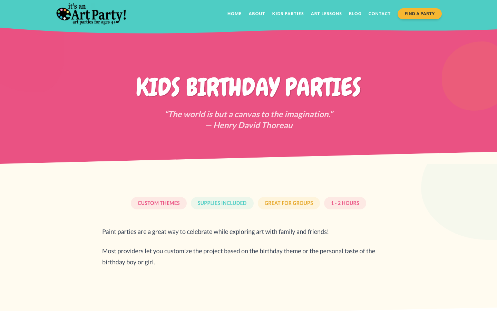

# It's an Art Party — multi-city provider directory

**Live:** https://www.itsanartparty.com/
**Built and operated by:** [Joshua Winningham](https://www.joshwinningham.com)

> The source code for It's an Art Party is private. This repository is a public showcase: a product overview, [architecture notes](ARCHITECTURE.md) derived from the real codebase, and [screenshots](screenshots/) of the live product. A code walkthrough is available on request via https://www.joshwinningham.com/#contact.

## What it does

It's an Art Party is a directory of kids' painting-party providers, with a live page for each city it covers. Families land on a city page from search, read local guidance about what a good paint party includes, and contact providers directly by phone, email or website. Providers sign up, create one free listing with their logo and details, and can upgrade to a paid "Sponsored Result" that places them at the top of their city's page with a badge.

The site began as a single Charlotte, NC party business built on WordPress. In March 2026 I rebuilt it in Next.js, preserving every old URL, and pivoted it into a multi-city directory. It now serves six city pages: Charlotte NC, Scottsdale AZ, Gilbert AZ, Frisco TX, Plano TX and Katy TX, launched on a roughly two-week cadence with unique local copy for each.

## Who uses it

- **Families** searching for a kids' painting party in their city: they browse the city page and contact a provider directly. No account is needed.
- **Providers** (studios and mobile painting-party businesses): they sign in, manage their listing, upload a logo, and subscribe to sponsored placement, all from the city page itself.
- **Me, as the operator**: listing creation, sponsorship changes, inquiries and sponsor waitlist signups all arrive as branded emails, so the inbox is the back office.

## My role

I designed, built, deployed and operate the site solo: the WordPress-to-Next.js migration, the directory product and its free-plus-sponsored model, Clerk authentication and billing, the database, uploads, transactional email, SEO and structured data, and the city expansion playbook.

## Key features

- **City directory pages** rendered on the server with incremental static regeneration and on-demand revalidation whenever a listing changes.
- **Provider self-service**: modal sign-up and sign-in, a listing form with logo upload, and immediate publication with no approval queue.
- **Sponsored Results**: a monthly subscription through Clerk Billing that flips a listing's placement server-side via signature-verified webhooks. Sponsors are ordered first-come-first-served by the moment their sponsorship started; free listings stay live if a subscription lapses, only the placement changes.
- **Soft sponsor cap** of three per city: when a city is full, the upgrade panel becomes an email waitlist.
- **Lifecycle email**: listing live, sponsorship active, sponsorship lapsed, plus admin notifications for every transition, inquiry and waitlist signup.
- **Search and AI visibility**: dynamic titles that include the live provider count, LocalBusiness ItemList and WebPage JSON-LD built from the actual listings, BlogPosting schema, a sitemap, and an `llms.txt` route.
- **Performance and privacy**: authentication JavaScript loads only on directory pages, images ship as AVIF and WebP with blur placeholders, analytics is deferred behind Largest Contentful Paint, and identifiable children were removed from all site imagery.

## Tech stack

| Layer | Choice |
|---|---|
| Framework | Next.js 16 (App Router, route groups, server components), React 19, TypeScript (strict) |
| Auth and billing | Clerk (modal auth, `PricingTable`, plan entitlements) with Clerk Billing on top of Stripe |
| Database | PostgreSQL on Vercel Postgres (Neon) with Drizzle ORM |
| Media | Vercel Blob for provider logos |
| Email | Resend with hand-built HTML templates |
| Styling | Tailwind CSS v4 and Tailwind Typography |
| Hosting | Vercel, auto-deploying from `main` |

## Why it's built this way

- **One table is enough.** The directory is a single `listings` table keyed by the provider's Clerk user id. Cities are page files rather than rows, which keeps the data model tiny and lets each city carry hand-written local copy instead of templated text.
- **Server-side truth for entitlements.** Whether a listing is sponsored is computed on the server from the provider's live billing plan and from webhook events, never from anything the browser sends. Webhook updates are conditional on the current state and only fire emails when a row actually changed, so redelivered events are harmless.
- **Placement, not access, is what you pay for.** A lapsed subscription never removes a listing; it just moves it below the sponsors. That keeps the directory full for families while keeping the upgrade meaningful.
- **Email as the admin surface.** For a directory of this size, an admin dashboard would be more code than value. Every event that matters is an email with reply-to set correctly, and the email layer never throws, so a mail outage can never break a listing save or a webhook.
- **Rendered for crawlers, interactive for providers.** Listings are server-rendered into the HTML for search engines and AI assistants; only the auth, form and upgrade panel are client components. Clerk is mounted in a directory-only route group so marketing pages ship none of it.
- **Old URLs are sacred.** Trailing slashes and a permanent redirect from the old blog path preserve every WordPress permalink from the original site.

## Screenshots

The captures below were taken with no active provider listings on the city pages, so they show the page structure rather than provider cards.

| | |
|---|---|
|  |  |
|  |  |
|  | |

## Source and walkthrough

The production repository is private. I am happy to walk through the code, the billing webhook and the city launch checklist on a call: **https://www.joshwinningham.com/#contact**.
